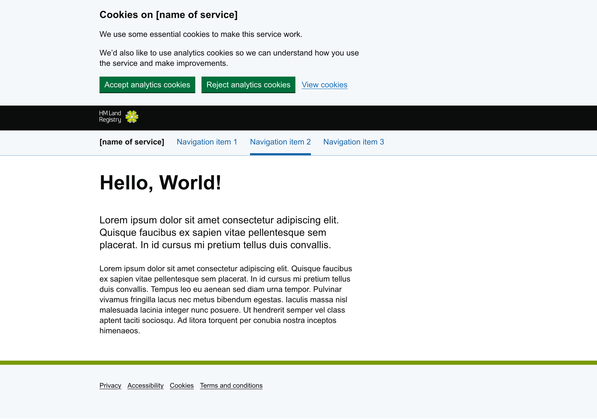

# HM Land Registry Frontend Webpack Demo




This repo demonstrates how to use [Webpack](https://webpack.js.org/) to bundle, compile and minify JavaScript, SCSS, images, and fonts, while optimising the output for performance. It uses various loaders and plugins to process files and generate the final build:

- [**CSS Minimizer Webpack Plugin**](https://webpack.js.org/plugins/css-minimizer-webpack-plugin/): Uses [CSSNANO](https://cssnano.github.io/cssnano/) to minimise the CSS output, reducing file size and improving page load times.
- [**PostCSS Preset Env**](https://github.com/csstools/postcss-plugins/tree/main/plugin-packs/postcss-preset-env): Uses [Autoprefixer](https://github.com/postcss/autoprefixer) to add vendor prefixes and ensure compatibility with older browsers.
- [**PurgeCSS**](https://purgecss.com/): Analyses your content and your CSS files. Then it matches the selectors used in your files with the one in your content files. It removes unused selectors from your CSS, resulting in smaller CSS files.
- [**Babel Preset Env**](https://babeljs.io/docs/babel-preset-env): Transpiles ES6+ JavaScript for cross-browser compatibility while allowing the use of modern JavaScript features.
- [**Copy Webpack Plugin**](https://webpack.js.org/plugins/copy-webpack-plugin/): Automates copying images from [HMLR Design System](https://hmlr-design-system.herokuapp.com/) to the output directory.
- [**Webpack Dev Server**](https://webpack.js.org/configuration/dev-server/): Serves files from the output directory with live reloading for development workflows.

## Prerequisites

- A supported LTS version of [Node.js](https://nodejs.org/en)
- [Node Version Manager](https://github.com/nvm-sh/nvm) (optional)
- [Docker](https://www.docker.com/) (optional)

## Get started

You can run on your local host, or in a Docker container:

### On your host

1. Install Node, preferably using `nvm`. The version is set in the `.nvmrc` file and is typically the latest LTS release codename.

   ```shell
   nvm install
   ```

2. Install the Node package dependencies from [npm](https://www.npmjs.com/):

   ```shell
   npm install
   ```

### Using Docker

1. Build the image

   ```shell
   docker build -t hmlr-webpack:latest .
   ```

2. Run the container

   ```shell
   docker run -p 9000:9000 hmlr-webpack:latest
   ```

## How to

### Use GOV.UK Design System components

The `main.scss` file at `/src/scss` is highly selective about which `components` are imported above the required `base`, `core`, `objects`, `utilities` and `overrides`. Components account for around 70% of the output CSS, so should only be included if they are used in the service, in order to keep distributon file sizes small.

By default, the following components are imported:

- [Cookie banner](https://design-system.service.gov.uk/components/cookie-banner/)
- [Footer](https://design-system.service.gov.uk/components/footer/)
- [Header](https://design-system.service.gov.uk/components/header/)
- [Service navigation](https://design-system.service.gov.uk/components/service-navigation/)
- [Skip link](https://design-system.service.gov.uk/components/skip-link/)

Simply uncomment any other components in `main.scss` that you need to use.

The same approach applies to JS; the `main.mjs` file at `/src/js` only imports JS for the components being used:

- Service navigation
- Skip link

> **Note**: The JS for the Header component is not needed when using the newer [Service navigation](https://design-system.service.gov.uk/components/service-navigation/) component alongside it.

For comparison (using GOV.UK Frontend v5.9.0):

| Asset           | Size (KB) |
| --------------- | --------- |
| Precompiled CSS | 127       |
| Selective CSS   | 18 (-86%) |
| Precompiled JS  | 49        |
| Selective JS    | 5 (-90%)  |

### Format source code

Use [Prettier](https://prettier.io/), an opinionated code formatter, for consistency.

To check formatting (without changing):

```shell
npm run format:check
```

To reformat files:

```shell
npm run format:fix
```

### Lint source code

Use [ESLint](https://eslint.org/) to statically analyse your code to quickly find problems.

To check for issues:

```shell
npm run lint:check
```

To attempt to automatically fix issues:

```shell
npm run lint:fix
```

### Build assets

Use [Webpack](https://webpack.js.org/) loaders and plugins to output CSS, JS, fonts and images to `./dist`:

```shell
npm run build
```

### Watch changes

Rebuild distribution assets automatically when source is changed:

```shell
npm run watch
```

### Run dev server

Start a simple web server with live reloading:

```shell
npm start
```

Go to <http://localhost:9000>

### Upgrade dependencies

Use [npm-check-updates](https://www.npmjs.com/package/npm-check-updates) to upgrade Node package dependencies (such as [govuk-frontend](https://www.npmjs.com/package/govuk-frontend)):

```shell
npm run upgrade:latest
```

If you want to be more cautious you can apply only minor or patch level upgrades:

```shell
npm run upgrade:minor
```

```shell
npm run upgrade:patch
```
